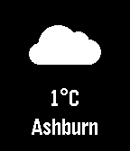

# pebble-weather

Copy of [pebble-examples](https://github.com/pebble-examples)/[pebblekit-js-weather](https://github.com/pebble-examples/pebblekit-js-weather) with additional functionality.

- [Slate App Configuration](https://developer.getpebble.com/tutorials/intermediate/slate/)
- [OpenWeatherMap](http://openweathermap.org) API Key configuration and persistence
- Weather value persistence

Uses static char to TupletCString workaround discussed [here](https://forums.getpebble.com/discussion/10690/the-address-of-will-always-evaluate-as-true)

[Import into CloudPebble](https://cloudpebble.net/ide/import/github/idiotandrobot/pebble-weather/)
